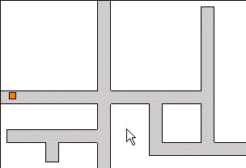



## \[ A RPG Helper 2 \]

### Description

My code is just here to help anyone who is need of help when creating their own RPG. My code just as some basics, collision detection, and 'scrolling' techiques... Hope you guys find it useful... Please, leave you comments and votes... I will be adding comments to my code very soon :)
 
### More Info
 

             |
---                |---
**Submitted On**   |2004-05-07 18:26:24
**By**             |[JamesJD](https://github.com/Planet-Source-Code/PSCIndex/blob/master/ByAuthor/jamesjd.md)
**Level**          |Intermediate
**User Rating**    |4.4 (22 globes from 5 users)
**Compatibility**  |VB 6\.0
**Category**       |[Games](https://github.com/Planet-Source-Code/PSCIndex/blob/master/ByCategory/games__1-38.md)
**World**          |[Visual Basic](https://github.com/Planet-Source-Code/PSCIndex/blob/master/ByWorld/visual-basic.md)
**Archive File**   |[\[\_A\_RPG\_He174328582004\.zip](https://github.com/Planet-Source-Code/jamesjd-a-rpg-helper-2__1-53661/archive/master.zip)

